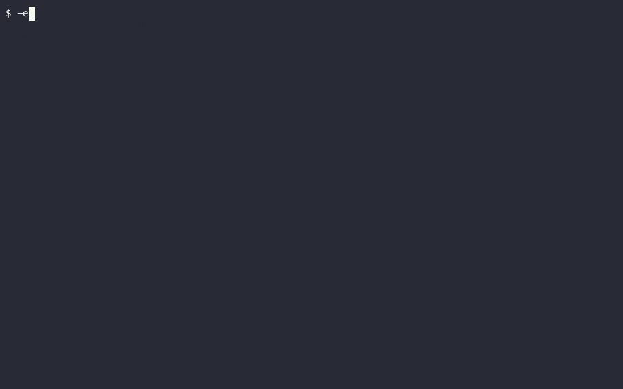
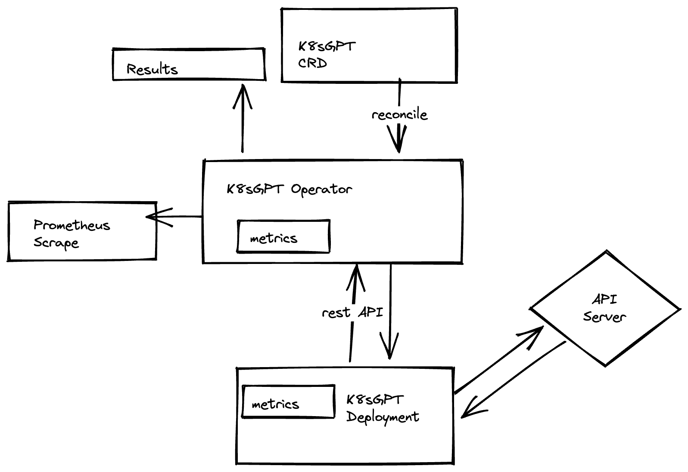

<picture>
  <source media="(prefers-color-scheme: dark)" srcset="./images/banner-white.png" width="600px;">
  
</picture>
<br/>

[](https://artifacthub.io/packages/search?repo=k8sgpt)

This Operator is designed to enable K8sGPT within a Kubernetes cluster.
It will allow you to create a custom resource that defines the behaviour and scope of a managed K8sGPT workload. Analysis and outputs will also be configurable to enable integration into existing workflows.


## Installation

```
helm repo add k8sgpt https://charts.k8sgpt.ai/
helm install release k8sgpt/k8sgpt-operator
```

## Run the example



1. Install the operator from the [Installation](#installation) section.

2. Create secret:
```sh 
kubectl create secret generic k8sgpt-sample-secret --from-literal=openai-api-key=$OPENAI_TOKEN -n default
```

3. Apply the K8sGPT configuration object:
```sh
kubectl apply -f - << EOF
apiVersion: core.k8sgpt.ai/v1alpha1
kind: K8sGPT
metadata:
  name: k8sgpt-sample
  namespace: kube-system
spec:
  model: gpt-3.5-turbo
  backend: openai
  noCache: false
  version: v0.2.7
  enableAI: true
  secret:
    name: k8sgpt-sample-secret
    key: openai-api-key
EOF
```

4. Once the custom resource has been applied the K8sGPT-deployment will be installed and
you will be able to see the Results objects of the analysis after some minutes (if there are any issues in your cluster):

```bash
❯ kubectl get results -o json | jq .
{
  "apiVersion": "v1",
  "items": [
    {
      "apiVersion": "core.k8sgpt.ai/v1alpha1",
      "kind": "Result",
      "metadata": {
        "creationTimestamp": "2023-04-26T09:45:02Z",
        "generation": 1,
        "name": "placementoperatorsystemplacementoperatorcontrollermanagermetricsservice",
        "namespace": "default",
        "resourceVersion": "108371",
        "uid": "f0edd4de-92b6-4de2-ac86-5bb2b2da9736"
      },
      "spec": {
        "details": "The error message means that the service in Kubernetes doesn't have any associated endpoints, which should have been labeled with \"control-plane=controller-manager\". \n\nTo solve this issue, you need to add the \"control-plane=controller-manager\" label to the endpoint that matches the service. Once the endpoint is labeled correctly, Kubernetes can associate it with the service, and the error should be resolved.",
```

## LocalAI Example

1. Install the operator from the [Installation](#installation) section.

2. Follow the [LocalAI installation guide](https://github.com/go-skynet/helm-charts#readme) to install LocalAI. (*No OpenAI secret is required when using LocalAI*).

3. Apply the K8sGPT configuration object:
```sh
kubectl apply -f - << EOF
apiVersion: core.k8sgpt.ai/v1alpha1
kind: K8sGPT
metadata:
  name: k8sgpt-local-ai
spec:
  namespace: default
  model: gpt-3.5-turbo
  backend: local-ai
  noCache: false
  version: v0.2.7
  enableAI: true
EOF
```

4. Same as step 4. in the example above.

## Architecture



## Helm values

| Parameter | Description | Default |
| --------- | ----------- | ------- |
| `serviceMonitor.enabled` | Enable Prometheus Operator ServiceMonitor | `false` |
| `controllerManager.manager.image.repository` | Image repository | `k8sgpt/k8sgpt-operator` |
| `controllerManager.manager.image.pullPolicy` | Image pull policy | `IfNotPresent` |
| `controllerManager.manager.image.tag` | Image tag | `v0.2.7` |
| `controllerManager.manager.imagePullSecrets` | Image pull secrets | `[]` |

