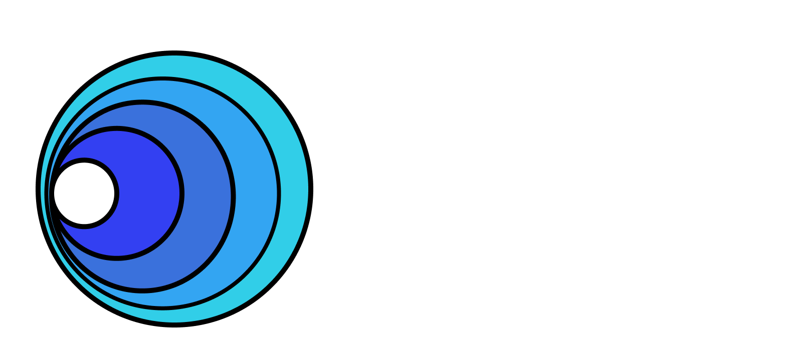

This Operator is designed to enable K8sGPT within a Kubernetes cluster.
It will allow you to create a custom resource that defines the behaviour and scope of a managed K8sGPT workload. Analysis and outputs will also be configurable to enable integration into existing workflows.


## Installation

```
helm repo add k8sgpt https://charts.k8sgpt.ai/
helm install release k8sgpt/k8sgpt-operator
```

## Run the example


1. Install the operator from the [Installation](#installation) section.

2. Create secret:
```sh 
kubectl create secret generic k8sgpt-sample-secret --from-literal=openai-api-key=$OPENAI_TOKEN -n default
```

1. Apply the K8sGPT configuration object:
```sh
kubectl apply -f - << EOF
apiVersion: core.k8sgpt.ai/v1alpha1
kind: K8sGPT
metadata:
  name: k8sgpt-sample
spec:
  namespace: default
  model: gpt-3.5-turbo
  backend: openai
  noCache: false
  version: v0.2.7
  enableAI: true
  secret:
    name: k8sgpt-sample-secret
    key: openai-api-key
EOF
```

## Architecture


## Contributing

Please see our community [contributing guidelines](https://github.com/k8sgpt-ai/community) for more information on how to get involved.

